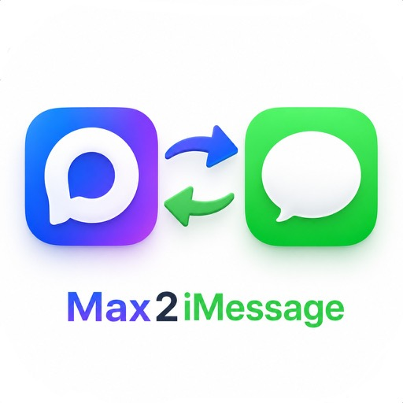

<p align="center">
  
</p>

# Max2iMessage

> macOS menu bar app that forwards [MAX](https://web.max.ru) messenger notifications to iMessage and Email.

Нативное macOS-приложение (Menu Bar), которое отслеживает новые сообщения в веб-версии [MAX](https://web.max.ru) и пересылает уведомления через iMessage и/или Email.

Все вычисления выполняются локально на вашем Mac. Пароли MAX не сохраняются.

## Возможности

- Несколько аккаунтов MAX — у каждого свой получатель
- Пересылка в **iMessage**, **Email** или **оба канала** одновременно
- Ручная авторизация через встроенный WKWebView
- Событийный мониторинг входящих сообщений (перехват WebSocket, opcode 128)
- Защита от дублей (персистентное хранение обработанных message ID)
- Журнал событий в файле (только в Debug-сборке при выключенном режиме приватности)
- Автопереподключение при сетевых ошибках
- Автозапуск при входе в macOS (опционально)
- **Умная пересылка** — настраиваемая задержка и пропуск уже просмотренных в MAX сообщений (на любом устройстве)
- **Настраиваемая задержка** перед отправкой (0–60 с, по умолчанию 1.5 с)
- **Режим приватности** — в собранной версии включён всегда: скрывает интерфейс MAX после входа, не пишет журнал
- **Формат пересылки** — полный текст или только «Имя написал(а) в MAX» (на каждый аккаунт)
- Фильтры: свои сообщения, групповые чаты, заглушённые чаты, вложения без текста

## Требования

- macOS 15.6+
- Для iMessage: приложение Messages с настроенным iMessage
- Для Email: приложение Mail с настроенным исходящим аккаунтом
- Аккаунт MAX (web.max.ru)

## Установка (без Xcode)

1. Скачайте **Max2iMessage-v1.4-macos.zip** из [Releases](https://github.com/ilcommm/Max2iMessage/releases/latest)
2. Распакуйте архив и перетащите **Max2iMessage.app** в папку «Программы»
3. При первом запуске macOS может заблокировать приложение — откройте **Системные настройки → Конфиденциальность и безопасность** и нажмите **Всё равно открыть**, либо щёлкните по `.app` правой кнопкой → **Открыть**
4. Дальше следуйте разделу [Первый запуск](#первый-запуск)

> Сборка подписана development-сертификатом и не проходит notarization Apple — это нормально для open-source релиза без платного Developer ID.

## Сборка из исходников

Требуется Xcode 16+.

1. Откройте `Max2iMessage/Max2iMessage.xcodeproj` в Xcode
2. Выберите target **Max2iMessage**
3. Убедитесь, что в Signing & Capabilities указана ваша Development Team
4. Соберите и запустите (`Cmd+R`)

## Несколько аккаунтов (семья, близкие)

Каждый аккаунт MAX — отдельная сессия и свой получатель (телефон, Apple ID или email).

1. В меню выберите **Добавить аккаунт…** (или в настройках нажмите **+**)
2. Задайте название, например «Мама» или «Жена»
3. В **Настройки → Пересылка** выберите канал и укажите получателя
4. Нажмите **Войти в MAX для этого аккаунта** и авторизуйтесь в MAX (QR-код с телефона близкого человека)
5. Повторите для каждого человека

В меню отображаются все аккаунты со статусом. Сообщения из каждого MAX пересылаются только своему получателю.

**Совет для общего Mac:** в **Настройки → Формат сообщения** выберите «Только уведомление» — на этом компьютере не будет сохраняться текст чужих переписок, уведомление получателю всё равно придёт.

## Режим приватности

В **собранной версии** (скачанной из Releases) режим приватности **включён всегда** и не отключается. Он нужен, если на одном Mac настроены аккаунты близких и вы не хотите, чтобы кто-то мог просмотреть их диалоги MAX или журнал приложения.

| Что делает | Подробнее |
|------------|-----------|
| Скрывает MAX после входа | Интерфейс web.max.ru доступен только для авторизации; после входа окно закрывается |
| Нет журнала | Файл `app.log` не создаётся, пункт «Открыть логи» скрыт |
| Нет диагностики | Отключены chat_raw, pipeline_trace и просмотр MAX в настройках |
| Фоновая отправка | iMessage и Email отправляются в фоне, без активации Messages/Mail |

При **запуске из Xcode** (Debug-сборка) режим можно включать и выключать в **Настройки → Приложение → Режим приватности** — для отладки.

## Пересылка: iMessage и Email

В **Настройки → Пересылка** для каждого аккаунта:

| Канал | Куда уходит | Что нужно |
|-------|-------------|-----------|
| iMessage | Телефон или Apple ID на iPhone | Messages с iMessage |
| Email | Адрес получателя | Mail с исходящим аккаунтом |
| iMessage и Email | Оба канала | Оба приложения настроены |

Получателя можно выбрать из контактов macOS (телефон или email).

## Формат сообщения

В **Настройки → Формат сообщения** для каждого аккаунта:

- **Полный текст** — `Имя: текст сообщения` (по умолчанию, удобно если пользуетесь сами)
- **Только уведомление** — `Имя написал(а) в MAX` — текст сообщения не передаётся

Для Email тема письма: `MAX: Имя отправителя`.

## Умная пересылка и задержка

По умолчанию включена в **Настройки → Фильтры → Умная пересылка**.

Если вы уже читаете чат в MAX (в браузере, на телефоне или в переписке с ботом), приложение не будет слать дублирующие уведомления. Перед отправкой оно ждёт **заданное время** (по умолчанию 1.5 с) и проверяет статус прочтения по данным протокола MAX:

- `mark` / `unread` во входящем пакете сообщения (opcode 128)
- уведомление о прочтении `NOTIF_MARK` (opcode 130) — приходит во все сессии, в том числе в скрытый WKWebView Max2iMessage

**Задержка перед отправкой** (0–60 с) настраивается в **Настройки → Фильтры**:

- при умной пересылке — ожидание до проверки прочтения;
- без умной пересылки — просто пауза перед отправкой;
- **0** — без задержки (мгновенная пересылка).

## Первый запуск

1. В строке меню появится иконка Max2iMessage
2. Откройте **Настройки**, выберите канал пересылки и укажите получателя (телефон, email или выбор из контактов)
3. Нажмите **Войти в MAX** и авторизуйтесь на web.max.ru
4. После входа статус аккаунта станет **Online**
5. При первой отправке macOS запросит разрешение **Automation** для Messages и/или Mail — разрешите

### Разрешения macOS

| Разрешение | Зачем |
|------------|-------|
| Automation → Messages | Отправка iMessage через AppleScript |
| Automation → Mail | Отправка Email через AppleScript |
| Contacts | Выбор получателя из контактов |
| Network | Подключение к web.max.ru |

Путь к логам (только если режим приватности выключен, например в Debug из Xcode): `~/Library/Logs/Max2iMessage/app.log`

Данные приложения: `~/Library/Application Support/Max2iMessage/`

## Smoke-test чеклист

- [ ] Приложение запускается как Menu Bar app (без иконки в Dock)
- [ ] Меню показывает статус аккаунта и счётчики за сегодня
- [ ] Окно «Войти в MAX» открывает web.max.ru и сохраняет сессию после перезапуска
- [ ] В Release-сборке после входа окно MAX закрывается, повторно открыть интерфейс нельзя (пока Online)
- [ ] После входа статус меняется на Online
- [ ] Входящее сообщение MAX пересылается в выбранный канал (iMessage / Email) в заданном формате
- [ ] Повторная отправка того же сообщения после рестарта не происходит
- [ ] Фильтр «свои сообщения» не пересылает исходящие
- [ ] «Умная пересылка»: прочитанное в MAX не уходит; непрочитанное — после задержки
- [ ] Настраиваемая задержка работает (0 = мгновенно, 1.5 с = по умолчанию)
- [ ] При отключении сети статус переходит в Reconnecting и восстанавливается
- [ ] «Только уведомление» отправляет `Имя написал(а) в MAX` без текста сообщения
- [ ] Режим «iMessage и Email» отправляет на оба канала
- [ ] В Release-сборке app.log не создаётся, «Открыть логи» скрыт
- [ ] В Debug из Xcode при выключенном режиме приватности события пишутся в app.log
- [ ] Toggle автозапуска работает (Системные настройки → Общие → Объекты входа)

## Архитектура

```
MenuBarView → AppState → AccountManager → AccountRuntime (per account)
                                              ├── MaxWebSession (WKWebView)
                                              ├── max-monitor.js (WS hook)
                                              ├── DedupStore
                                              └── MessageForwarder (AppleScript → Messages / Mail)
```

Мониторинг сообщений: injected JS перехватывает WebSocket-пакеты страницы MAX и отправляет `NOTIF_MESSAGE` (opcode 128) и `NOTIF_MARK` (opcode 130) в Swift через `WKScriptMessageHandler`. Умная пересылка в `AccountRuntime` откладывает отправку и сверяет `mark` с позицией прочтения.

## Ограничения

- Протокол MAX не является публичным API и может измениться
- Для стабильной работы требуется активная сессия web.max.ru
- Отправка iMessage зависит от приложения Messages и разрешения Automation
- Отправка Email зависит от приложения Mail, настроенного исходящего аккаунта и разрешения Automation

## Контакты

**Developer:** Ilya Kleshnin  
**Email:** [ilcommm@gmail.com](mailto:ilcommm@gmail.com)

## Лицензия

[MIT](LICENSE)
